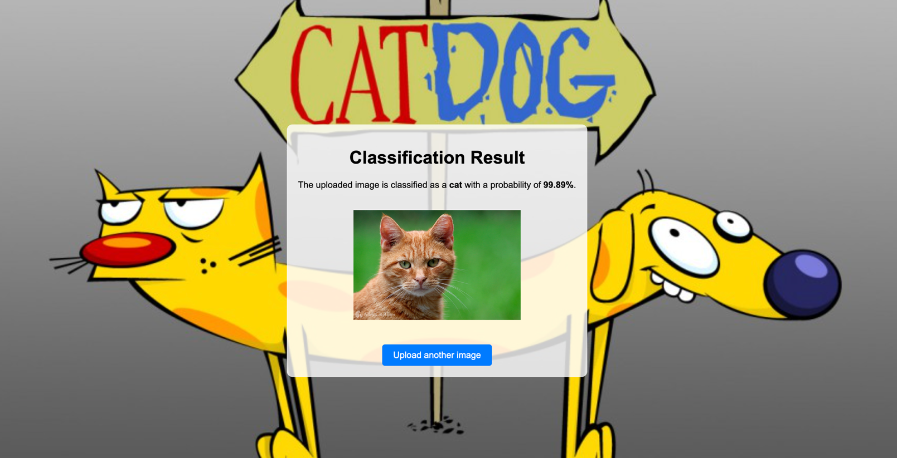

# Cat or Dog Classifier Web Application

This project is a web-based application built using Flask that allows users to upload an image of a cat or dog and receive a prediction indicating the probability that the image contains a cat or a dog. The application utilizes a pre-trained Convolutional Neural Network (CNN) model to perform the classification.

### Features

### User-friendly Interface:
The application features a simple and intuitive interface where users can easily upload an image.

### Real-time Prediction:
Once an image is uploaded, the application quickly processes the image and returns a prediction with the probability score.
### Responsive Design:
The application pages are centered and styled with a custom background image to enhance the user experience.
Model Integration: The application leverages a pre-trained TensorFlow Keras model to classify the images accurately.

### Getting Started
#### Prerequisites
-Python 3.x

-Flask

-TensorFlow

### Project images



Ensure you have Python and pip installed. You can install the required dependencies by running:

```shell
pip install Flask tensorflow
Running the Application
Clone the repository:


git clone https://github.com/yourusername/cat-dog-classifier.git
cd cat-dog-classifier

Place your pre-trained model file (cat_dog.keras) in the static/models/ directory.

Start the Flask application:


python app.py
Open your web browser and go to http://localhost:5000/ to use the application.
```
Google Collab model:
https://colab.research.google.com/drive/15JFCr0CpPqRTeAH6loVVn5W9tiezx4pT?usp=sharing
